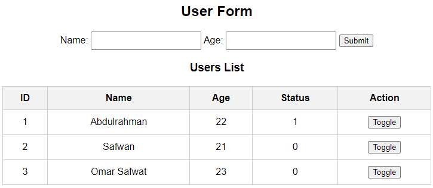

# 💻 PHP MySQL User Status Manager

This is a simple web-based project that allows users to enter their name and age, and stores the data in a MySQL database. Each user also has a toggleable **status** (active/inactive) that can be updated directly from the user table.

---

## 🎯 Project Goal  
Learn how to:
- Use HTML forms to accept user input  
- Store data in a MySQL database using PHP  
- Display users in a table format  
- Update user status with a toggle button  
- Handle basic database operations (Insert, Update, Fetch)

---

## 🧱 What We Did

We created a dynamic website using PHP, which connects to a MySQL database.  
Users can:
- Submit their name and age  
- View the list of registered users  
- Toggle the status of each user (Active / Inactive)

We designed the database using **phpMyAdmin** and exported the structure to `users_db.sql`.  
We used **XAMPP** as a local server to run the project.

---

## 📦 Files Included

- `index.php` → Main project file (handles form + data display)  
- `users_db.sql` → SQL file to import the database structure  
- `README.md` → This documentation

---

## 🛠️ Tools & Technologies  
- 🧠 PHP (backend logic)  
- 🗃️ MySQL (database)  
- 🖥️ HTML & CSS (frontend)  
- ⚙️ XAMPP (Apache & MySQL server)  
- 🧑‍💻 Visual Studio Code

---

## 🧪 How It Works

1. User submits name and age using the form  
2. PHP stores the data into the `users` table  
3. The table below the form shows all users  
4. The **Status** column can be toggled by clicking a button  
5. Status is stored in the database as `0` (Inactive) or `1` (Active)

---

## 🗃️ Database Schema (users_db.sql)

```sql
CREATE TABLE `users` (
  `ID` int NOT NULL AUTO_INCREMENT,
  `Name` varchar(100),
  `Age` int,
  `Status` tinyint DEFAULT 0,
  PRIMARY KEY (`ID`)
);
```

---

## 🚀 How to Run the Project Locally

1. Install XAMPP
2. Start Apache and MySQL
3. Open phpMyAdmin and:
4. Create a database called > users_db
5. Import > users_db.sql
6. Place the project folder in > C:\xampp\htdocs\users
7. Open your browser and go to:
   http://localhost/users/index.php

---

## 📸 Project Preview



---

## 👤 Author
> Designed by: [Abdulrahman Qutah]
> Date: [7 July 2025]
